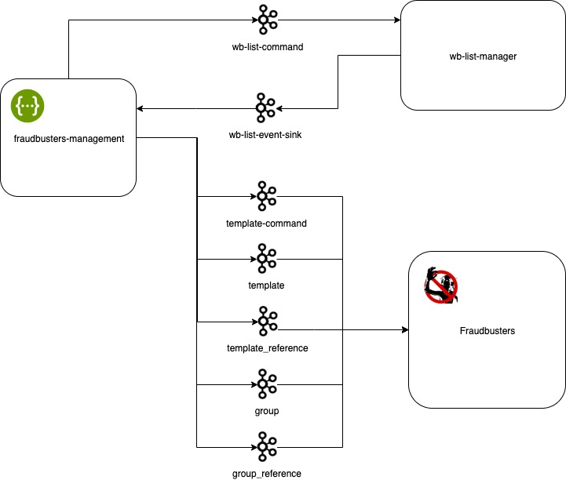

# Fraudbusters Management

Service for managing antifraud patterns and black/white/name lists

Provides a swagger interface for creating, deleting and modifying templates, as well as managing groups and bundles of
patterns. Also provides a swagger interface for creating, deleting and reading black / white / name lists.

### Service Interaction Topology.

The service interacts with fraudbusters and wb-list-manager through the kafka topics using the following protocols,
respectively

- [Fraudbusters Proto](https://github.com/rbkmoney/fraudbusters-proto/blob/master/proto/fraudbusters.thrift)
- [Wb List Proto](https://github.com/rbkmoney/wb-list-proto/blob/master/proto/wb_list.thrift)



### Build

```mvn clean package```

### Start

```java -jar target/fraudbusters-management.jar```

### Link

http://localhost:8080/fb-management/v1/swagger-ui.html#/

### License

[Apache 2.0 License.](/LICENSE)
